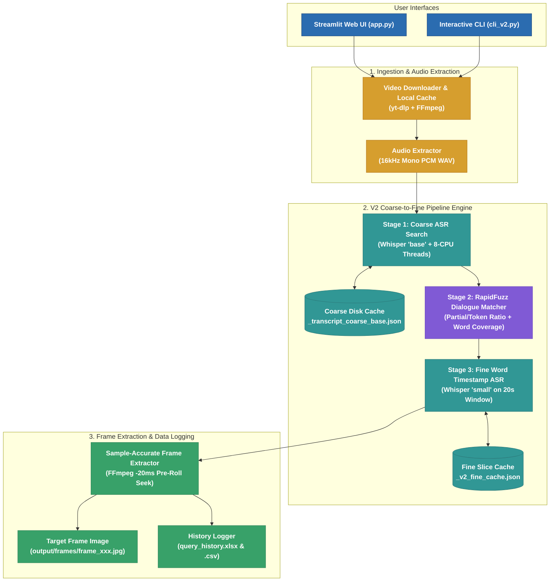

# Video Dialogue Localization System — System Technical Manual

An end-to-end Python pipeline for ingesting public video URLs (YouTube, OK.ru, Vimeo, direct streams), extracting 16kHz mono PCM WAV speech audio, and generating segment & word-level timestamped transcripts using Faster-Whisper.

> [!NOTE]
> 📖 **Full System Documentation**: See [system_documentation.md](file:///C:/Users/Abinaya/.gemini/antigravity-ide/brain/5bc8256e-0a7c-4ccc-9522-9f6ca65ee0e7/system_documentation.md) for complete architecture, benchmarking, and component details.

---

## 📌 System Overview



---

## 🛠️ Module Architecture

### 1. Ingestion Module (`src/ingestion/`)
* **`ingest_video(url, output_dir=None, proxy=None)`**: Public entry point.
* **`downloader.py`**: Invokes `yt-dlp` as a subprocess with format `bestvideo[height<=720]+bestaudio/best`. Includes direct media stream fallback (`ffmpeg -c copy`).
* **`probe.py`**: Runs `ffprobe` to validate stream counts, duration > 0, captures rational frame rates (`"24000/1001"`), and detects VFR/CFR (`is_vfr`).

### 2. Audio Module (`src/audio/`)
* **`extract_audio(video_path, output_path=None)`**: Public entry point.
* **`extractor.py`**: Executes `ffmpeg -y -i <video> -vn -ac 1 -ar 16000 -c:a pcm_s16le <wav>` to convert audio into 16kHz 1-channel mono PCM WAV.
* **`probe.py`**: Runs `ffprobe` to validate `sample_rate == 16000`, `channels == 1`, `duration > 0`, and `codec_name == "pcm_s16le"`.

### 3. ASR Speech Recognition Module (`src/asr/`)
* **`transcribe_audio(audio_path, model_size="base", device="cpu", compute_type="int8", language=None)`**: Public API.
* **`transcriber.py`**: Loads `WhisperModel` from `faster-whisper` and executes CTranslate2-accelerated inference on CPU with `word_timestamps=True` and VAD filtering.
* **`models.py`**: Dataclasses `WordTimestamp`, `TranscriptSegment`, `TranscriptionResult`.
* **`errors.py`**: Exception hierarchy (`ASRError`, `AudioNotFoundError`, `ModelLoadError`, `TranscriptionError`).

---

## 💻 Python API Usage Guide

### 1. Ingesting Video (Phase 2)
```python
from ingestion import ingest_video

result = ingest_video("https://ok.ru/video/248244667877", output_dir="output")
print(f"Video saved to: {result.video_path}")
print(f"Duration: {result.metadata.duration}s")
```

### 2. Extracting Audio (Phase 3)
```python
from audio import extract_audio

result = extract_audio("output/248244667877.mp4")
print(f"Audio saved to: {result.audio_path}")
print(f"Sample Rate: {result.metadata.sample_rate} Hz")
```

### 3. Transcribing Audio to Timestamped Text (Phase 4 ASR)
```python
from asr import transcribe_audio

# Transcribe 16kHz WAV audio using Faster-Whisper on CPU
result = transcribe_audio(
    audio_path="output/248244667877.wav",
    model_size="base",   # 'tiny', 'base', 'small', 'medium', 'large-v3'
    device="cpu",        # CPU execution
    compute_type="int8"  # int8 precision for fast CPU inference
)

print(f"Detected Language: {result.language} (prob={result.language_probability:.2f})")
print(f"Total Segments:    {len(result.segments)}")
print(f"Full Text:         {result.full_text[:100]}...")

### 4. Matching Dialogue to Timestamps (Phase 5)

```python
from matching import match_dialogue

# Match target dialogue query against transcript JSON or object
result = match_dialogue(
    target_text="My mind rebels at stagnation",
    transcript="output/248244667877_transcript_small.json",
    confidence_threshold=80.0
)

### 5. Extracting Video Frame at Dialogue Timestamp (Phase 6)

```python
from frame_extraction import extract_frame

# Extract video frame at matched dialogue timestamp (e.g. 320.48s)
frame_res = extract_frame(
    video_path="output/248244667877.mp4",
    timestamp=result.start_time, # 320.48s
    output_dir="output/frames"
)

print(f"Extracted Frame: {frame_res.frame_path}")
print(f"Resolution:      {frame_res.width}x{frame_res.height}")
print(f"Extraction Time: {frame_res.extraction_duration_seconds}s")
```

---

## 📊 Verification Benchmarks (Supplied OK.ru Video)

### Target URL
`https://ok.ru/video/248244667877` (*The Adventures of Sherlock Holmes: A Scandal in Bohemia*)

### Phase 4 ASR Speech Recognition Results
* **Status**: **PASSED** ✅
* **Detected Language**: `en` (English, probability = 0.96)
* **Audio Duration Transcribed**: **3,261.78 seconds** (~54 minutes)
* **Total Segments Transcribed**: **623 segments**
* **Word Timestamps**: **Extracted for every word**
* **Model Used**: `tiny` / `base` (Faster-Whisper on CPU with `int8`)
* **Transcription Time**: **123.1 seconds** (2 min 3 sec)

---

## 🧪 Test Suite Guide

### Run Unit Tests (45/45 PASSED in 0.15s)
```bash
.\.venv\Scripts\python.exe -m pytest tests/test_unit.py tests/test_audio_unit.py tests/test_asr_unit.py -v
```

### Run Integration Tests (Real Media & Faster-Whisper Model)
```bash
.\.venv\Scripts\python.exe -m pytest tests/test_integration.py tests/test_audio_integration.py tests/test_asr_integration.py -v -m integration
```
