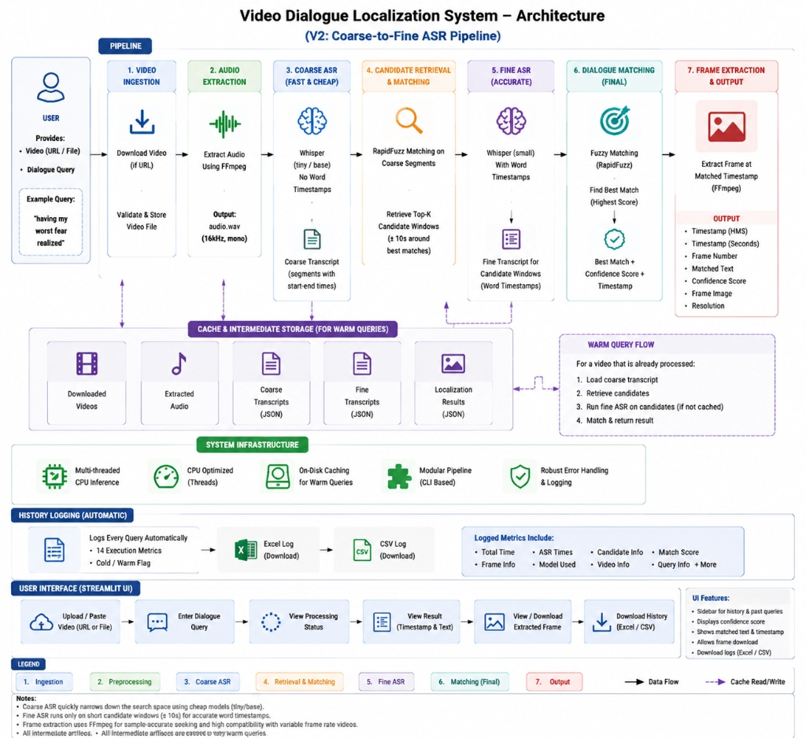
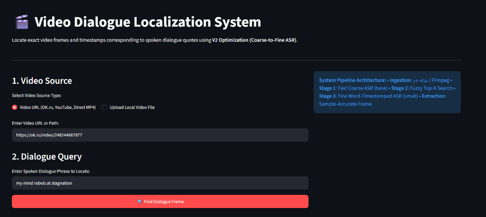
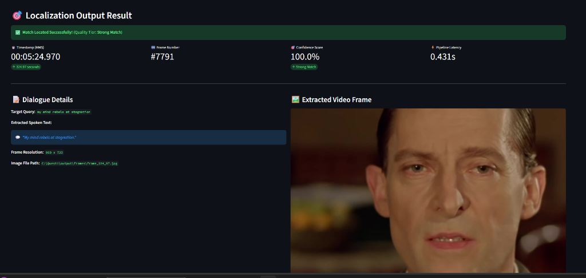

# 🎬 Video Dialogue Localization System

An automated AI pipeline that finds the exact timestamp and extracts the video frame where a spoken dialogue quote occurs in a video.

---

## 💡 What Does This System Do? (In Simple Terms)

If you have a long video (such as a 54-minute episode or YouTube clip) and you want to find the exact moment someone says a specific line:

1. **You provide:** A public video URL (or local video file) and the spoken quote (e.g., *"my mind rebels at stagnation"*).
2. **The system automatically:**
   - Downloads/extracts the audio track from the video.
   - Runs a **fast coarse search** across the entire video to quickly locate the approximate timestamp.
   - Runs a **precise fine search** on just that short ~20-second time window to get exact word-level timing.
   - Uses **FFmpeg** to seek to the exact timestamp and capture the video frame image.
3. **You receive:** The exact timestamp (`00:05:24.970`), frame number (`#7791`), confidence score (`100%`), execution latency (`0.43s`), and the extracted video frame image.

Repeated searches on the same video use **on-disk caching** to return results in **under 0.25 seconds**.

---

## 🏗️ System Architecture & Workflow

The system uses a **V2 Coarse-to-Fine ASR Pipeline** designed for high accuracy and fast CPU performance:



---

## 🖼️ User Interface & Results

### 1. Video & Query Input (Streamlit UI)
Select your video source (URL or uploaded file) and enter the target spoken dialogue quote:



### 2. Localization Output & Extracted Frame
The system locates the quote, calculates the exact timestamp, displays match details, and renders the extracted frame:



---

## 📚 Documentation & Development History

All full design documents, architecture explanations, benchmarks, and LLM development prompts are organized under the [docs/](https://github.com/abinayaa0/Quest1/tree/main/docs) directory:

- 📄 **[System Design & Engineering Approach](https://github.com/abinayaa0/Quest1/blob/main/docs/DESIGN_AND_APPROACH.md)** — Detailed technical design, pipeline stages, trade-off decisions, and benchmark matrices.
- 📝 **[Development & Code Generation Prompts](https://github.com/abinayaa0/Quest1/blob/main/docs/PROMPTS.md)** — Consolidated history of implementation prompts and research queries used during development.
- 📂 **[Explore Docs Directory](https://github.com/abinayaa0/Quest1/tree/main/docs)** — Browse all project documentation files.

---

## 📊 Query History & Logs

Every search query processed by the system is automatically logged with 14 execution metrics (timestamps, confidence score, frame resolution, latency, etc.):

- 📊 **[Download Query History (Excel Spreadsheet)](output/query_history.xlsx)**
- 📄 **[Download Query History (CSV Document)](output/query_history.csv)**

---

## 🚀 Quick Start Guide

### 1. Installation
Clone the repository and install the dependencies:
```bash
git clone https://github.com/abinayaa0/Quest1.git
cd Quest1
pip install -r requirements.txt
```
> *Note: Ensure [FFmpeg](https://ffmpeg.org/) is installed and available in your system PATH.*

### 2. Run the Streamlit Web Application
```bash
streamlit run app.py
```

### 3. Run via Command Line Interface (CLI)
```bash
python cli_v2.py --url "https://ok.ru/video/248244667877" --query "my mind rebels at stagnation"
```

---

## 🧪 Running Tests

To run the unit test suite:
```bash
pytest tests/test_unit.py tests/test_audio_unit.py tests/test_asr_unit.py -v
```
