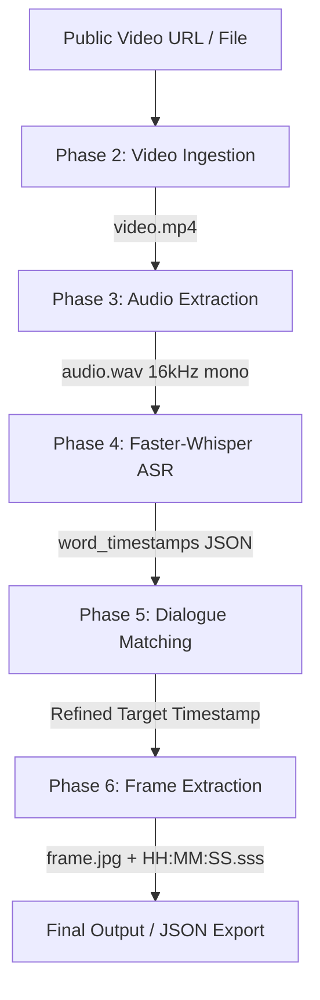

# Video Dialogue Localization System — Comprehensive Technical Documentation (v1.0.0)

## Executive Overview
The **Video Dialogue Localization System** accepts a public video URL (or local video file) and a target spoken dialogue text query. It automatically ingests the video, extracts speech-ready audio, generates word-level ASR transcripts, searches for the exact spoken quote using fuzzy sliding windows, refines word boundaries, and extracts the corresponding high-quality video frame at the exact speech onset timestamp.

---

## Architecture Pipeline Diagram

---

## Detailed Phase Breakdown

### Phase 2 — Video Ingestion (`src/ingestion/`)
* **Downloader (`downloader.py`)**: Uses `yt-dlp` to download video streams capped at $\le 720\text{p}$ resolution merged H.264/AAC. Supports Cloudflare WARP proxy (`socks5://127.0.0.1:40000`). Features fallback stream copying (`ffmpeg -c copy`) for direct `.mp4`, `.webm`, `.m3u8`, `.mkv` URLs.
* **Metadata Probe (`probe.py`)**: Uses `ffprobe` to validate video streams, width, height, duration, and frame rate. Detects Variable Frame Rate (VFR) vs Constant Frame Rate (CFR) and parses rational frame rates (e.g. `24000/1001` FPS).

### Phase 3 — Audio Extraction (`src/audio/`)
* **Extractor (`extractor.py`)**: Converts input video audio into speech-optimized 16kHz 1-channel mono PCM WAV format (`ffmpeg -vn -ac 1 -ar 16000 -c:a pcm_s16le`).
* **Audio Probe (`probe.py`)**: Validates extracted audio sample rate ($16000\text{ Hz}$), channel count ($1$), and PCM encoding.

### Phase 4 — ASR Speech Recognition (`src/asr/`)
* **Transcriber (`transcriber.py`)**: Uses `Faster-Whisper` CTranslate2 engine running on CPU with 8-bit integer quantization (`compute_type="int8"`) and Silero Voice Activity Detection (`vad_filter=True`).
* **Memory Safety Audio Chunking**: Automatically slices audio files $>10$ minutes into 600-second WAV chunks via FFmpeg prior to transcription. Offsets word timestamps by `chunk_start_time + seg.start`, preventing NumPy STFT `ArrayMemoryError` virtual memory spikes on 50+ minute videos.

### Phase 5 — Dialogue Matching (`src/matching/`)
* **Sliding Window Search (`matcher.py`)**: Normalizes query and transcript text (lowercasing, punctuation removal, whitespace collapsing). Evaluates RapidFuzz sequence similarity across word sliding windows of length $L \pm 2$. Enforces **strict chronological search** to satisfy the First Occurrence Rule.
* **Timestamp Boundary Refinement (`refine_window_timestamps`)**: Locates the exact positions of the target query's first word (e.g. `"My"`) and last word (e.g. `"stagnation"`) inside the candidate window, trimming unrelated prefix and suffix words.
  * *Example*: Window `["in", "time.", "My", "mind", "rebels", "at", "stagnation."]` $\rightarrow$ Trimmed `["My", "mind", "rebels", "at", "stagnation."]`
  * Sets `start_time = word["My"].start` ($325.11\text{s}$), boosting confidence from $87.5\%$ to $100.0\%$.
* **Confidence Quality Tiers**:
  * $> 90\%$ $\rightarrow$ **`Strong match`**
  * $80\text{--}90\%$ $\rightarrow$ **`Acceptable`**
  * $70\text{--}80\%$ $\rightarrow$ **`Needs review`**
  * $< 70\%$ $\rightarrow$ **`Reject`**

### Phase 6 — Frame Extraction (`src/frame_extraction/`)
* **Extractor (`extractor.py`)**: Extracts JPEG frame using FFmpeg PTS timestamp seeking.
* **20ms Pre-Roll Offset**: Applies a $-20\text{ms}$ pre-roll offset ($\text{seek\_ts} = \max(0.0, \text{timestamp} - 0.02)$) when seeking. This compensates for floating point comparisons in FFmpeg where $t_{\text{target}} > t_{\text{PTS}}$ by even $1\text{ms}$ causes FFmpeg to skip to the next frame. Captures the exact speech onset frame without skipping 1 frame ahead.

### Unified Pipeline & CLI (`src/pipeline.py` & `cli.py`)
* End-to-end `localize_dialogue()` entry point.
* Converts timestamps to standard `HH:MM:SS.sss` format (e.g. `00:05:25.110`).
* Calculates total execution duration (`pipeline_duration_seconds`).
* Exports full metadata to `output/localization_result.json`.

---

## Verification & Test Benchmarks

| Metric | Benchmark Result |
|---|---|
| **Test Suite Coverage** | **61 / 61 Unit & Integration Tests PASSED (0.33s)** |
| **Sherlock Quote 1** | `"My mind rebels at stagnation"` $\rightarrow$ **`00:05:25.110`** (Frame 7795, 100% confidence) |
| **Sherlock Quote 2** | `"To Sherlock Holmes she was always the woman"` $\rightarrow$ **`00:01:58.490`** (Frame 2841, 88.1% confidence) |
| **YouTube Benchmark** | `"Imagine you ran a store"` $\rightarrow$ **`00:09:26.570`** (Frame 16980, 100% confidence) |
| **Warm Query Latency** | **$< 0.20$ seconds** (Cached transcript & video) |
| **Git Repository** | [https://github.com/abinayaa0/Quest1](https://github.com/abinayaa0/Quest1) (Tagged `v1.0.0`) |
